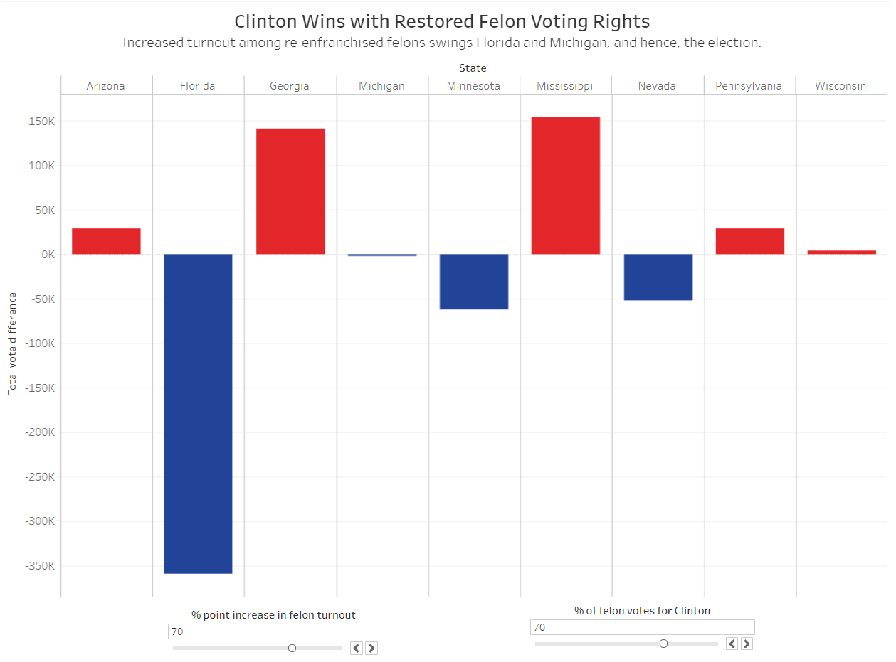

---
output:
  slidy_presentation: default
editor_options: 
  chunk_output_type: console
---

# US Voter Disenfranchisement: </br>How state laws stop eligible voters

Neville Fernandes, Constance McCarney, Priyanka Pandey, Kyle Riener and Tyler Young

[Link to 90 sec Overview Video](https://youtu.be/2hFawQW1v2Q)

## US Voting in Theory and Practice

The foundation of a representative democracy is the vote of its citizens. The government can only truly claim to represent the people when all citizens are able to exercise their right to vote. Certainly, some individuals may make a personal choice not to vote, but this too is an expression of their right. 

The U.S. Constitution grants the right to vote to all citizens over the age of 18. However, the process of conducting fair elections and establishing the eligibility of voters is left to the states. As a result, obstacles may arise which discourage an individual from voting. These obstacles may be intentional, such as laws or regulations meant to exclude, or they could simply be unintended consequences based on practices or norms thought to be fair and impartial. Regardless, the result is voter suppression and it undermines the integrity and validity of our elections and government.

Voter identification laws disproportionately affect non-white and low-income voters in large parts of the US because they are less likely to have the most basic form of identification: a driver’s license. While states reasonably need to determine where polling locations will be and when the polls will be open, these very practical limitations affect low-income voters differently as they may not be able to afford taking unpaid time from work in order to stand in line on election day. 

In 2016, 6.1 million people of voting age were made ineligible to vote by felon voting laws. According to The Sentencing Project, in all but two US states incarcerated felons, those on parole or probation, or those post-incarceration cannot vote (Uggen, Shannon, & Manza, 2010). The process to re-apply for voting rights is tedious and opaque in some states. Since people of color are incarcerated at higher rates than whites, these laws also disproportionately prevent their participation as voters. 

## The Data

Our main data source for this project comes surveys conducted by the US Census Bureau in 2016. We downloaded multiple files, each with various demographic information such as race, income, disability, and employment. We merged these together along with results from the 2016 election to use as our main data file. Information on early voting, absentee and mail-in ballots and voter ID laws came from the National Council of State Legislatures. These were html tables that we entered into a csv file to use in our analysis. Additionally, the [2016 Sentencing Project](http://www.sentencingproject.org/wp-content/uploads/2016/10/6-Million-Lost-Voters.pdf) provided details on the felon voting laws and estimates of the population affected at the state level, for which there was no official source before (Uggen, Shannon, & Manza, 2010).

```{r Library and Data, message=FALSE, warning=FALSE}

library(tidyverse)

census <- read.csv("Data/census_with_election_data.csv") %>% 
    mutate(turnout = (total_votes/X18.and.over.population)*100)

laws <- read.csv("Data/Voting Laws by State Revised.csv")

df <- left_join(census, laws, by=c('state.name'='State'))

df <- df[complete.cases(df),]

felons_all <- read.csv("Data/2016_felon_disenfranchisement_state.csv")

felons_merge <- left_join(felons_all, felons_black, by=c('State'='State'))
state_election <- read.csv("Data/state_election_data.csv")
```

Since all of the demographic information was reported as percentages of a county population, we needed to create new category variables to better isolate the effects on the voting laws on different populations of interest. As such low, middle, and high income counties were defined and counties were designated as either containing high or low for the portion of residents with a disability.

Additionally, we ranked the level of difficulty that laws governing early voting, mail-in ballots and voter identification presented to voters on a scale of 1 to 3, with 3 being the most restrictive. Using these scores we created an overall score on the ease of voting in each state on a scale of 3 to 9. States scoring a 3 or 4 were categorized as flexible while states scoring an 8 or 9 were considered restrictive.

```{r New Vars message=FALSE, warning=FALSE}

df$EarlyVoting = case_when(df$EarlyVotingDays == 0 ~ "None",
                            df$EarlyVotingDays >= 18 ~ "18 to 45",
                            TRUE ~ "3 to 15")

df$bcollar <- df$Service + df$Natural.resources..construction..and.maintenance.occupations + df$Production..transportation..and.material.moving.occupations

df$wcollar <- df$Management..business..science..and.arts.occupations+ df$Sales.and.office.occupations

df$AwD <- if_else(df$Percent.With.a.disability >= 20, "High", "Low")

df$MailScore <- case_when(df$VoteByMail == "All Mail" ~ 1,
                         df$VoteByMail == "Any Absentee" ~ 2,
                         df$VoteByMail == "Excuse Only" ~ 3)

df$EarlyScore <- case_when(df$EarlyVoting == "None" ~ 3,
                          df$EarlyVoting == "3 to 15" ~ 2,
                          df$EarlyVoting == "18 to 45" ~ 1)

df$IDScore <- case_when(df$VoterID == "No ID" ~ 1,
                       df$VoterID == "Non Photo ID" ~ 2,
                       df$VoterID == "Strict Non-Photo" ~ 2,
                       df$VoterID == "Photo ID" ~ 3,
                       df$VoterID == "Strict Photo ID" ~ 3)

df$VoterScore <- df$MailScore + df$EarlyScore + df$IDScore

df$VoteCate <- case_when(df$VoterScore <= 4 ~ "Easy",
                         df$VoterScore >= 8 ~ "Hard",
                         TRUE ~ "Neutral")

df$DiverseCounty <- case_when(df$White <= .65 ~ "Yes",
                              TRUE ~ "No")

df$IncomeLevels <- case_when(df$Median.household.income < 40000 ~ "Low",
                             df$Median.household.income >= 55000 ~ "High",
                             TRUE ~ "Mid")
```

Since the census_with_election_data master file doesn't have data election results data for Alaska, we created another data file for plotting the effect of restoring voting rights to felons (re-enfranchisement). The state-level election results were sourced from [US Election Atlas](https://uselectionatlas.org/RESULTS/) and was merged with the felon data. The missing state name fields were updated and the felon data, census data and state election data were all combined into one data frame. Finally, since the state election data had strings for numerical data, it was cleaned and converted into numeric type. 
```{r}
census_DT <- as.data.table(census)
census_DT[grepl("Alaska", census_DT$Geography_x)]$county <-  gsub(",.*$", "", census_DT[grepl("Alaska", census_DT$Geography_x)]$Geography)
census_DT[grepl("Alaska", census_DT$Geography_x)]$st <- "AK"
census_DT[grepl("Alaska", census_DT$Geography_x)]$state.name <- "Alaska"

census_DT[grepl("District", census_DT$Geography_x)]$county <-  "Washington"
census_DT[grepl("District", census_DT$Geography_x)]$st <- "DC"
census_DT[grepl("District", census_DT$Geography_x)]$state.name <- "District of Columbia"

census_state <- census_DT %>%  group_by(state.name) %>%  summarise(Population=sum(Total.population), Males=sum(Male), Females=sum(Female), VAP=sum(X18.years.and.over), VAP_Male=sum(X18.years.and.over...Male), VAP_Female=sum(X18.years.and.over...Female))

census_state <- census_state[2:52, ]

df2 <- left_join(census_state, state_election, by=c('state.name'='State'))
df2 <- left_join(df2, felons_all, by = c("state.name" = "State"))

# Removing special characters from string columns and converting them to numeric
df2 <- data.frame(lapply(df2, gsub, pattern = ",", replacement = ""))
df2 <- data.frame(lapply(df2, gsub, pattern = "%", replacement = ""))

as.numeric.factor <- function(x) {as.numeric(levels(x))[x]}
df2[, c(2:29)] <- sapply(df2[, c(2:29)], as.numeric.factor)

write.csv(df2, file = "elections_with_all_felons.csv") # Write CSV in R

```

## County Distribution of Voter Turnout

Counties with more flexible voting laws have, on average, a higher voter turnout. This implies that some people do not vote simply because they are not able to. There are multiple possible reasons for this such as not having time on a Tuesday to go vote or not having easy access to a polling location. Whether intentional or not, some states are excluding citizens from elections because the current laws and system make it too difficult to vote. We will take a deeper look into some of these possible explanations and see what factors are having the biggest impact.


```{r Graphs Overall Turnout Density, warning=FALSE}

ggplot(df, aes(x=turnout, group=VoteCate)) + 
    geom_density() +
    xlim(0,100) +
    labs(x="County voters as percentage of 18 years and older population",
         title="Flexible Voting Laws Increase Turnout",
         subtitle="In the 2016 general election, ease of voting is determined by restrictiveness of voter ID laws, number of early voting days, and vote by mail provisions.",
         caption="Sources: Population and election data from the U.S. Census Bureau. Voting laws from the National Council of State Legislatures. Excludes Alaska.") +
    annotate(geom = "text", x = c(46,74), y = c(.04,.045), label = c("Strict", "Flexible") , color="black", size=3) +
    theme_minimal() +
    theme(axis.title.y=element_blank(),
          axis.text.y=element_blank(),
          axis.ticks.y=element_blank(),
          legend.position="none",
          panel.grid.minor=element_blank(),
          panel.grid.major=element_blank())
          
```


## Voter turnout in low income counties

For counties with the lowest median household income, we wanted to visualize how voting regulations affected their turnout. The graph below shows that counties in the bottom quartile for income will generally have higher rates of voter turnout the more flexible voting laws are. The encouraging takeaway is that it seems more flexible policies that remove barriers to voting have an effect on turnout, however this also means that currently some voices are being suppressed from strict voting laws.


We chose a density plot because we thought it clearly showed a difference between the different groups. We also wanted to limit unnecessary information so we removed gridlines and the y-axis, keeping only the labels for 'flexible' and 'strict'.

```{r Graphs Turnout and Income, warning=FALSE}

df %>% filter(IncomeLevels == "Low") %>% ggplot() + 
    geom_density(aes(x=turnout, group=VoteCate)) + 
    xlim(0,100) +
    labs(x="County voters as percentage of 18 years and older population",
         title="Restrictive Voting Laws Suppress Low-Income Turnout",
         subtitle="In the 2016 general election, low income counties see lower turnout when early voting days and mail-in ballots are curtailed and photo IDs are required.",
         caption="Sources: Population and election data the from U.S. Census Bureau. Voting laws from the National Council of State Legislatures. Excludes Alaska.") +
    annotate(geom = "text", x = c(47,72), y = c(.051,.052), label = c("Strict", "Flexible") , color="black", size=3) +    theme_minimal() +
    theme(axis.title.y=element_blank(),
          axis.text.y=element_blank(),
          axis.ticks.y=element_blank(),
          legend.position="none",
          panel.grid.minor=element_blank(),
          panel.grid.major=element_blank())

```

## Voter turnout in high income counties
Contrary to low income counties, the high income counties do not see much change in voter turnout. No matter how strict the voting laws are, the average turnout remains the same for high income voters. This suggests that wealthy citizens have an easier time voting and an advantage in getting their voices heard. It is encouraging to see such a high proportion of voters exercising their right, but these graphs highlight a gap between low and high income counties that needs to be addressed.


```{r Graphs Drafts Income, warning=FALSE}

df %>% filter(IncomeLevels == "High") %>% ggplot() + 
    geom_density(aes(x=turnout, group=VoteCate)) + 
    xlim(0,100) +
    labs(x="County voters as percentage of 18 years and older population",
         title="High Income Voters are Immune to Structural Barriers",
         subtitle="Turnout in high income counties remains similar regardless of how strict voting laws are",
         caption="Sources: Population and election data the from U.S. Census Bureau. Voting laws from the National Council of State Legislatures. Excludes Alaska.") +
    theme_minimal() +
    theme(axis.title.y=element_blank(),
          axis.text.y=element_blank(),
          axis.ticks.y=element_blank(),
          legend.position="none",
          panel.grid.minor=element_blank(),
          panel.grid.major=element_blank())


```

## Voter turnout and Americans with disabilities

From this graph we see the distribution of the turnout rates and the percentage of people with disability. Polling place inaccessibility may contribute to the lower voter turnout, both directly by making voting more difficult for people with disabilities, and indirectly by sending the message that people with disabilities are not expected to participate in the political sphere. We explore the role of polling place inaccessibility by examining voter turnout and reports of voting
difficulties among people with disabilities in US elections. We have tried to show it for all voters group, any voters and Excused only Group.


```{r Graphs Draft Turnout Disability, warning=FALSE}

df %>% filter(AwD == "High") %>% ggplot() + 
    geom_density(aes(x=turnout, group=VoteByMail)) + 
    xlim(0,100) +
    labs(x="County voters as percentage of 18 years and older population",
         title="All Mail Ballots Expand Access for Americans with Disabilities",
         subtitle="Removing barriers, like requesting an absentee ballot, improves voter turnout in counties where more than 20% of residents have a disability.",
         caption="Sources: Population and election data the from U.S. Census Bureau. Voting laws from the National Council of State Legislatures. Excludes Alaska.") +
    annotate(geom = "text", x = 72, y = .052, label = "All Mail Ballots", color="black", size=3) +
    theme_minimal() +
    theme(axis.title.y=element_blank(),
          axis.text.y=element_blank(),
          axis.ticks.y=element_blank(),
          legend.position="none",
          panel.grid.minor=element_blank(),
          panel.grid.major=element_blank())

```
## What if turnout increased...

### Narrative Improvement
In thinking about our overall narrative that voter disenfranchisement is an issue that negatively impacts America by affecting the electoral mandate, we wanted to show a sceneraio of what might happen if more voters had turned out for the 2016 presidential election. We then perform a deeper dive into analyzing how that can happen by looking at empowering certain slices of the voting-age population. In this case, we demonstrate how restoring voting rights to felons could increase overall turnout and affect the election results. In this particular year, a large increase in the overall turnout leads to the vote margin in the state of Florida and Michigan changing from being in Donald Trump's favor to Hillary Clinton. We find that re-enfrachisement of felons could similarly lead to Florida and Michigan flipping to Clinton. In both cases, the electoral votes from those two states hand over the election to Clinton, a Democrat. This is just one way of measuring the impact of increased voter turnout on the results and that impact could be different if some other demographic groups was analyzed. Hopefully in future years increasing the voter turnout could become a bipartisan effort because the ideal of American democracy is to give everyone the opportunity to vote and make their voice heard. Voter turnout defines elections and if the U.S. wants to truly be a representative democracy, we should be striving to have as many people show up to vote as possible.


### 1. Across all demographics (measured at county-level)

Screenshots are posted below and the interactive dashboard can be found [here](https://public.tableau.com/profile/tyler.young#!/vizhome/TeamProjElection/StateDifferences):

**Before increase in voter turnout**


**After increase in voter turnout**


### 2. Due to re-enfranchisement of felons (measured at state-level)

Screenshots of the before- and after-scenarios are posted below and the interactive dashboard can be found [here](https://public.tableau.com/profile/neville.fernandes#!/vizhome/Felonswithvotemargins/Dashboard1):

**Before increase in voter turnout due to felon re-enfrachisement**


**After increase in voter turnout due to felon re-enfrachisement**


The first slider adjusts the hypothetical turnout of disenfranchised felons, as defined by the specific restrictions valid in each state. The second slider adjusts the hypothetical percent of that felon voting population that supports candidate Clinton. In all of the state included in this graph, the state population of disenfranchised felons is greater than the margin of votes between Trump and Clinton. 
This change is applied to each state, the hypothetical vote totals are summed up and the difference in vote totals for Trump and Clinton graphed above. Trump wins if positive (shown in red) and Clinton wins if negative (shown in blue).

If the newly enfranchised felons turnout is at 30% and 69% of them vote Democrat (Uggen and Manza, 2002), then Clinton wins a majority in Florida. Michigan flips with 70% of the felon vote, if they vote at the rate the rest of the state's population (63%). Vote turnout percentages were sourced from a 2016 report by Parlapiano and Pearce in the New York Times.

### Making of: Thoughts/Reasons
These dashboards were not part of the first version, but we will still discuss the decisions behind the 'making of' for them. The goal of these visualizations was to show that increasing voter turnout could make a significant impact on the results of the election. The two dashboards were created on Tableau and capture the impact of voter turnout (Dashboard 1 - all demographics, Dashboard 2 - re-enfranchised felons) on the 2016 presidential election results. The data for the first dashboard was sourced from the census_with_election_data CSV file and that for the second one was sourced from the elections_with_all_felons CSV file. A parameter was created in Tableau in both dashboards for increasing the percentage points in voter turnout (or re-enfranchised felons turnout), which was designed to be applied uniformly to all counties (or states). But for the first dashboard, counties were prevented from having a turnout of over 100%. If the slider is moved to 0.1, voter turnout is increased by 10 percentage points.

In the first visualization, the potential votes from that increase that would be added to a county were split amongst the candidates based on how the county had already voted. In the second visualization, the those potential votes were split according to value selected in the second control - the percentage of votes for Clinton. The difference in total votes (both actual plus potential) for each candidate is displayed on the graph. We could have graphed 2 bars for each state with the total votes for Clinton and Trump, but when trying to maximize the data-pixel-ratio, we thought it would be better to show one bar as the difference for each state and both the direction and color of the bar indicate who would have won the election. Unnecessary gridlines were also removed. Several of the swing states were added and the ability for the user to select states was also allowed.  In the first visualization, Florida and Michigan were the only two states that flipped, but other states come close as well. In the second visualization, all of the red states eventually flip to blue (i.e. Trump majority changed to Clinton majority) as both levers are changed to 100%. The reason for allowing the user to pick additional states was to prevent it from seeming biased to only picking states that flipped in Clinton's favor. In reality, a user has the ability to check that Florida and Michigan would flip with these calculations and they would both go from Trump to Clinton, therefore handing over the election to Clinton.

# References

Parlapiano, A., & Pearce, A. (Sep 2016). _For Every 10 U.S. Adults, Six Vote and Four Don’t. What Separates Them?_ From [The New York Times](https://www.nytimes.com/interactive/2016/09/13/us/politics/what-separates-voters-and-nonvoters.html).  
Uggen, C., Manza, J. (Dec 2002). Democratic Contraction? _Political Consequences of Felon Disenfranchisement in the United States._ American Sociological Review, Vol. 67, No. 6, pp. 777-803. From [New York University](https://as.nyu.edu/content/dam/nyu-as/faculty/documents/Democratic_Contraction.pdf).  
Uggen, C., Shannon, S., & Manza, J. (2010). _State-Level Estimates of Felon Disenfranchisement in the United States, 2010._ Washington, D.C.: The Sentencing Project.

